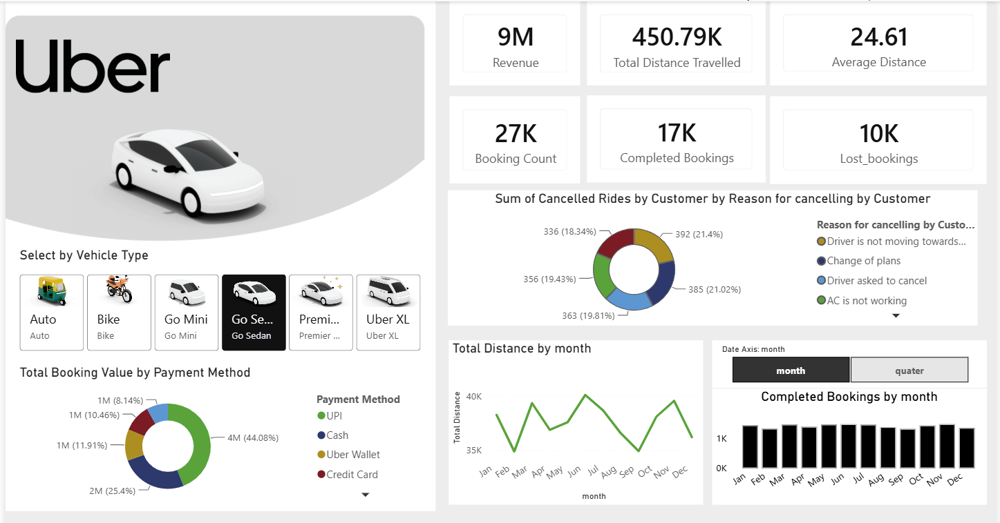

# 🚖 Uber Trip Analysis Dashboard | Power BI

## 📌 Project Overview
An interactive Power BI dashboard built to analyse Uber trip booking data and generate business insights. The project focuses on data cleaning, transformation, DAX calculations, and dashboard development to understand revenue, bookings, trip trends, cancellations, and vehicle performance.

## 🎯 Objectives
- Analyse booking and revenue performance
- Track completed and cancelled trips
- Identify vehicle-wise performance trends
- Understand customer payment preferences
- Support data-driven business decisions

## 📂 Dataset
The project uses an Excel-based Uber booking dataset containing:
- Booking ID
- Booking Date
- Vehicle Type
- Booking Status
- Trip Distance
- Revenue
- Payment Method
- Cancellation Reason

## 🧹 Data Preparation
Data cleaning and transformation performed using Power Query:
- Removed unnecessary columns
- Corrected data types
- Handled missing values
- Standardised data for analysis

## 📊 Dashboard Features
- Revenue and booking KPIs
- Completed vs lost bookings analysis
- Vehicle-wise performance
- Monthly booking trends
- Distance analysis
- Payment method distribution
- Cancellation analysis
- Interactive filters for vehicle type, month, and quarter
- 

## 📐 Power BI Skills Used
- Power Query
- Data Cleaning
- Data Transformation
- Data Modelling
- DAX Measures
- KPI Reporting
- Data Visualisation

## 🛠️ Tools & Technologies
- Microsoft Power BI
- Microsoft Excel
- Power Query
- DAX
- Business Intelligence

## 📁 Project Structure
Uber-PowerBI-Dashboard/
│── README.md
│── Uber Dashboard.pbix
│── uber.xlsx
└── dashboard.png

## 💡 Key Insights
The dashboard helps analyse operational performance, identify booking trends, evaluate cancellations, compare vehicle performance, and understand customer behaviour.

## 👨‍💻 Author
**Sambhav Jain**  
Aspiring Data Analyst  

**Skills:** Power BI • Excel • SQL • Python • Data Analytics
